# 蓝盾FAQ

#### Q: 流水线的各个状态代表什么意思？

流水线的状态汇总如下：&#x20;

 (1).png>)

#### Q: 蓝盾流水线进度条是怎么计算的？

进度条是蓝盾前端根据流水线相关的数据做出的预估。此进度不是准确的时间，仅供参考。&#x20;

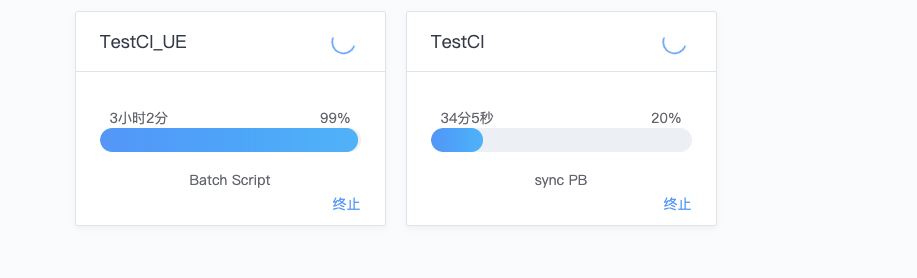

#### Q: 蓝盾流水线构建出的产物如何支持服务器分发限速配置?

调整分发源的限速，如下图。 对于已经安装agent的机器，可以先移除，再安装。 分发源机器IP: 192.168.5.134&#x20;

 (1).png>)

#### Q: 如何获取流水线id？

流水线url中，pipeline后的参数分别为项目id和流水线id。如：http://devops.oa.com/console/pipeline/iccentest/p-8f3d1b399897452e901796cf4048c9e2/history 中，iccentest 为项目id，p-xxx 即为流水线id。

#### Q: 项目名称是否支持修改？

项目名称可在项目管理内更改，项目英文缩写（即项目id）不能更改。 &#x20;

.png>)

 (1) (1).png>)

#### Q: 流水线执行失败了，插件为什么没有重试按钮？

只有最新一次的构建可以重试。

#### Q: 如何通过蓝盾将构建产物自动分发到指定服务器？

有了部署机器，我们可以将构件分发至测试机上了。首先添加一个无编译环境Job 3-1，添加插件作业平台-构件分发并完成配置。&#x20;

 (1).png>)

#### Q: 蓝盾有哪些全局变量？

https://iwiki.woa.com/pages/viewpage.action?pageId=26941983

#### Q: 查看日志时，如何查看时间戳？

查看日志页，Show/Hide Timestamp&#x20;

 (1).png>)

#### Q: 蓝盾流水线中的视图管理、标签管理有什么用？

对流水线进行分类，当流水线数量较多时，标签、视图会有更大作用。

#### Q: 为什么有时候会出现需要申请流水线权限的情况，但是F5刷新之后恢复？

存在权限冲突，在用户组权限里，是有多个流水线的权限。 但是自定义里面只有一个流水线的权限。 后续更新版本会修复这个问题。解决方案为删除自定义权限。后续会通过版本更新修复该问题。&#x20;

 (1).png>)

#### Q: python的环境变量添加后，在job执行的时候未生效。（job报错“系统找不到指定的文件”）

因为蓝盾agent和蓝鲸agent使用的账户是system，所以加到administrator的环境变量不生效 需要把python.exe和pip3.exe pip.exe加入到系统环境变量里，再重启操作系统

#### Q: 可以通过蓝盾流水线上传构建产物到指定私有GitLab仓库吗？

蓝盾git插件暂无push功能。用户可将ssh私钥放置构建机上，在Batch Script插件或者Bash插件里使用git命令push产物达到临时解决方案。

#### Q: 怎么在bash插件之间传递变量，上一个bash插件输出变量，下一个bash插件能引用到？

蓝盾为bash插件提供了 setEnv 命令来设置蓝盾的全局变量, `setEnv '变量名' '变量值'` 如：

`setEnv 'cmdb' '3.2.16'`

setEnv 设置的是当前bash的输出参数，在下游才会生效，当前的bash里打印不出来的。

在windows batchscript插件里使用`call:setEnv "FILENAME" "package.zip"` 然后在后续的batchscript插件中使用%FILENAME%引用这个变量

#### Q: 节点机器，显示正常，为什么监控网络io没有数据？

 (1).png>)

没有启用. 这个监控并无意义, 也不影响调度. 建议使用蓝鲸监控等专门的监控系统负责.

如果要启用:

```
1. 配置 bin/03-userdef/ci.env 
2. 添加 BK_CI_ENVIRONMENT_AGENT_COLLECTOR_ON=true
3. 然后添加 influxdb相关的配置项.
4. 重新安装ci-environment. 可以直接使用 ./bk_install ci 安装.
5. 修改已有agent:编辑.agent.properties , 配置devops.agent.collectorOn=true, 重启agent.
```

#### Q: 有方法可以从标准运维调用蓝盾吗？

流水线stage-1 trigger选择remote. 然后标准运维调用job快速执行脚本, 调用remote插件里提示的url.

#### Q:构建里面怎么使用docker build 打包镜像，然后推送镜像到harbor，我的是dockerbuild环境 里面没有docker命令

可以使用私有构建机. 容器内是没有dockerd的, 出于安全考虑, 容器内是不能操作主机的dockerd的，或者如果蓝盾使用者是受信任的话，可以使用我们交付团队的DinD**方案**

#### **Q:**使用docker build生成镜像是不是只能使用私有构建机才行？

建议使用私有构建机, 公共构建机DinD方案存在安全隐患, 所以需要私有构建机制作镜像.&#x20;

如果蓝盾使用者是受信任的话，可以使用我们交付团队的DinD**方案**

#### Q:ci不显示日志

.png>)

查看对应微服务日志 /data/bkce/logs/ci/log/

 (1).png>)

一个index占了12个shards，超过了es7 设置的shards最大值，这是es7的限制

解决方法：清理一些无用的索引

```
查看目前所有的索引
source /data/install/utils.fc
curl -s -u elastic:$BK_ES7_ADMIN_PASSWORD -X GET http://$BK_ES7_IP:9200/_cat/indices?v
删除索引 # index 是索引名称
curl -s -u elastic:$BK_ES7_ADMIN_PASSWORD -X DELETE http://$BK_ES7_IP:9200/index
# 注意：不能删除 .security-7
```

.png>)

**另一种可能是用户未安装es7**

#### Q:公共构建机，这几类都支持吗？

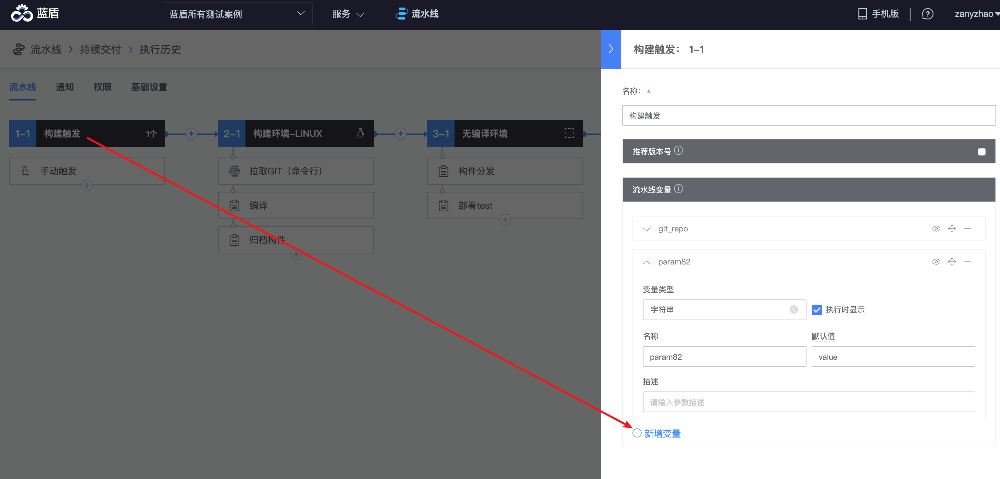

公共构建机依赖docker, 只能运行linux. 目前只能运行基于我们 bkci/ci:alpine (debian系统)制作的构建镜像.

#### Q:私有构建机必须是物理机吗？可以是docker容器吗?

私有构建机和项目绑定, 且需安装agent并注册. 建议使用物理机/虚拟机等变动少的场景. 容器化使用公共构建机即可.

#### Q:上传镜像报错，程序默认把http方式换成https了

 (1) (1).png>)

docker默认是https的, 这个要改服务端的docker. 需要在dockerhost机器的/etc/docker/daemon.json添加insecure-registry.

BKCI这边推送镜像默认都走https，如果要走http需要把仓库域名配置进insecure

走https的话如果仓库域名不是docker客户端开始装的时候对应的那个证书的话，需要在构建机导入这个域名对应的证书 &#x20;

#### Q:no available Docker VM

.png>)

是没有可用的ci-dockerhost.需要:

1\. 在ci-dispatch节点执行 /data/src/ci/scripts/bkci-op.sh list 查看是否有状态为true的行.

2\. 如果依旧无法调度, 需要检查ci-dispatch的日志有无异常. 或者涉及dockerhost ip的日志.&#x20;

原因是当时部署蓝盾的时候因为服务器资源有限，把构建机 微服务 网关都放到一台机器上 导致构建机内存使用率过高，构建环境的时候找不到可用构建机，现在把构建机单独部署到别的机器上 之前的那些报错就都没了。

#### Q: 哪里可以查看上传到 制品库 的jar包？使用默认方式&#x20;

蓝鲸社区参考：[https://bk.tencent.com/s-mart/community/question/2380](https://bk.tencent.com/s-mart/community/question/2380)

#### Q:gitlab事件触发插件无法触发事件

参考 https://docs.bkci.net/reference/faqs 排查下

#### Q: 拉取镜像失败，错误信息：status 500

.png>)

用户自行配置的仓库，需要先保证网路可达

#### Q: 一台mac只能装一个agent吗

可以多个, 在不同目录启动agent即可. 每个agent实例需要全新安装, 不能直接复制已有agent目录.

#### Q: windos构建机 流水线执行用python去打开exe 失败

windows下，agent无法拉起有UI界面的exe

这个是windows  session 0 限制

#### Q: failed to connect to gitlib.xxx.com port 443:connection timed out 构建失败 提示连接443端口超时

 (1).png>)

这里断网的原因是dockerhost启动后, 执行过sysctl -p等价的命令, 导致 net.ipv4.ip\_forward 被重置为0, 导致容器断网.&#x20;

```
sysctl -p | grep -F net.ipv4.ip_forward
net.ipv4.ip_forward = 0
单独启动一个测试容器:
docker run -it --rm centos 
应该会看到
WARNING: IPv4 forwarding is disabled. Networking will not work.
容器内执行命令, 等待后会看到提示超时:
curl -m 3 -v paas.service.consul
然后执行 systemctl restart bk-ci-docker-dns-redirect
单独启动一个测试容器:
docker run -it --rm centos 
容器内执行命令, 可以看到网络恢复:
curl -v paas.service.consul
```

#### Q:agent里面需要连网下docker，服务器连不了网，要怎么处理呢？

目前公共构建机可以使用任意镜像, 无编译环境需要联网下载镜像.&#x20;

目前需要你将无编译环境部署到可联网的区域, 并放行访问docker hub的地址.&#x20;

公共构建机填写镜像地址为你们的私有docker registry.

并人工转存docker hub上的bkci/ci:latest到私有docker registry.

#### Q:新增完凭据之后 选择的时候没有

检查创建完毕后浏览器有无报错, 检查 ci-auth 及 ci-ticket 的日志有无异常.&#x20;

如果是普通用户创建的, 可以切换到管理员账户查看是否成功创建.&#x20;

#### Q: 挂载怎么用， 下拉框没数据

.png>)

这个需要维护一个NFS共享存储服务，不太推荐使用了，后续有可能移除

最好的做法是，将依赖工具打包到镜像里，有2个阶段&#x20;

阶段A 里面的 job 有个 task-A ：是克隆git 代码后构建编译打包jar

阶段B 里面的 job 有个 task-B：是把 task-A 中构建好的 jar  scp 到部署发布到服务器 。

验证下来的结果是 这两个阶段的 workspace 是不共通的。目前的做法是我都放到一个  Job里面才行，这样才能共用一个 workspace 里面构建生产的 jar文件。

设计如此，CI的产物如果要部署出去，必须走到制品库，用maven私服的思路没错

#### Q: 研发商店：插件配置文件\[task.json]atomCode字段与工作台录入的不一致

 (1).png>)

上传的，可能不是插件发布包，是源代码。发布过程看插件的readme

如果上传的是正确的发布包可以临时编辑插件zip包内的task.json, 修改atomCode(和上传界面一致, 不含下划线)后重新打包上传.

#### Q: 插件包上传失败

.png>)

可以先检查下blueking用户能否正常读写 artifactory数据目录: /data/bkce/public/ci/artifactory/

然后检查artifactory日志文件, 看看报错.

#### Q: 蓝盾添加节点的时候报错 bkiam v3 failed&#x20;

.png>)

#### 然后根据给出的文档排查了日志

/data/bkce/ci/environment/logs/environment-devops.log

/data/bkce/ci/environment/logs/auth-devops.log

.png>)

排查发现ci auth库下的 T\_AUTH\_IAM\_CALLBACK表 为空

原因是集群初始配置失败，但脚本并没有终止

```
ci初始化
reg ci-auth callback.
[1] 19:29:00 [SUCCESS] 172.16.1.49
{
  "timestamp" : 1626291190535,
  "status" : 500,
  "error" : "Internal Server Error",
  "message" : "",
  "path" : "/api/op/auth/iam/callback/"
}Stderr: * About to connect() to localhost port 21936 (#0)
解决方法：可尝试手动 注册ci-auth的回调.
source /data/install/load_env.sh
iam_callback="support-files/ms-init/auth/iam-callback-resource-registere.conf"
./pcmd.sh -H "$BK_CI_AUTH_IP0" curl -vsX POST "http://localhost:$BK_CI_AUTH_API_PORT/api/op/auth/iam/callback/" -H "Content-Type:application/json" -d @${BK_PKG_SRC_PATH:-/data/src}/ci/support-files/ms-init/auth/iam-callback-resource-registere.conf
```

#### Q: Upload artifacts这个上传功能是上传到当前使用stage的构建的构建机里面还是有单独的仓库位置&#x20;

归档构件，是把构建机上的产物归档到专用的产物仓库，产物仓库和构建机无关，由 Artifactory 服务决定。

CI 的归档，是将产物暂存到仓库，方便流水线下游操作使用，或者作为后续部署的来源，目前没有支持归档时根据当前构建机所在的云指定构件存储方式。

你描述的，看起来像是构件的分发，通过部署工具去操作可能更合理。

或者你也可以自定义插件自行实现归档

#### Q: bkci插件如何开发有文件说明吗？

插件开发指引：https://docs.bkci.net/store/plugins/create-plugin

#### Q: JOOQ;uncategorized SQLException for SQL

.png>)

旧sql没有清理的缘故

```
# 清理flag文件, 重新导入全部sql文件
for sql_flag in $HOME/.migrate/*_ci_*.sql; do
chattr -i "$sql_flag" && rm "$sql_flag"
done
# 导入数据库 SQL 仅在中控机执行
cd ${CTRL_DIR:-/data/install}
./bin/sql_migrate.sh -n mysql-ci /data/src/ci/support-files/sql/*.sql
```

#### Q: private configuration of key JOB\_HOST is missing

 (1).png>)

job脚本执行插件链接：[https://github.com/TencentBlueKing/ci-executeJobScript](https://github.com/TencentBlueKing/ci-executeJobScript)

私有配置缺少JOB\_HOST字段，按照上图配置好即可

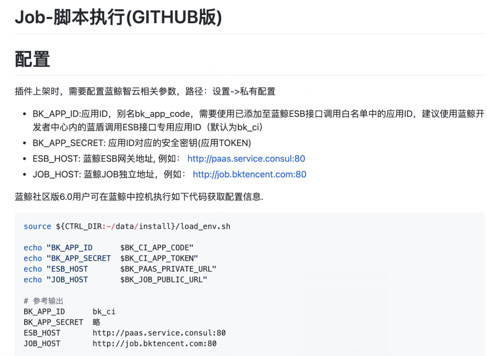

#### Q: 发送邮件插件不可用


插件的执行环境分为有编译和无编译，发送邮件插件的执行环境为无编译环境，在创建Job的步骤时，需要选Job类型为无编译环境，即Agentless

.png>)

 (1).png>)

#### Q: 发送邮件插件执行成功，但没收到邮件

邮件发送需要先配置ESB，请参考：[https://bk.tencent.com/s-mart/community/question/2532](https://bk.tencent.com/s-mart/community/question/2532)

#### Q: 发送邮件插件的sender配置不是我配置的sender

.png>)

sender需要在插件的「私有配置」里设置，独立于ESB的mail\_sender

「研发商店」-「流水线插件」-「工作台」-「选择发送邮件插件」-「基本设置」-「私有配置」-「增加sender字段」

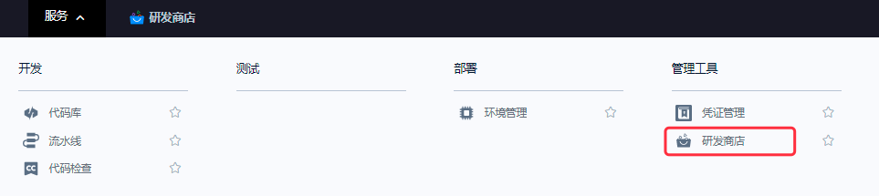

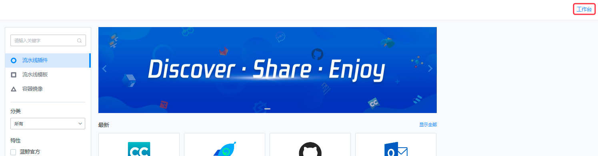

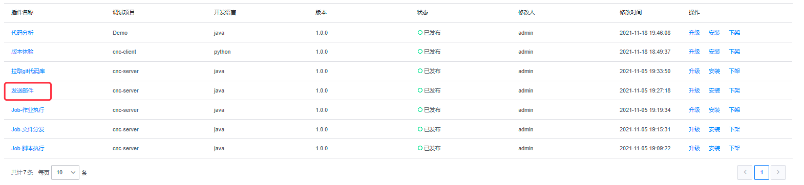

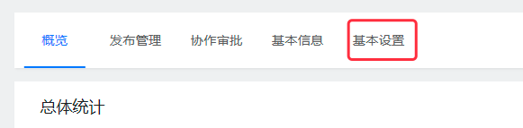

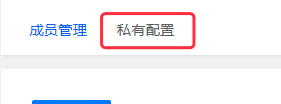

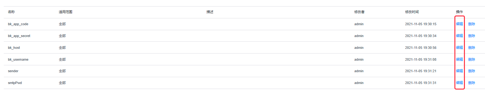

除了sender字段，还需要配置其他字段，请参考：[https://github.com/TencentBlueKing/ci-sendEmail](https://github.com/TencentBlueKing/ci-sendEmail)

#### Q: 配置平台里的业务，如何关联到容器管理平台？


1. 权限中心中检查，该用户账号是否具有local-k8s」的配置平台权限
2. 配置平台中检查，「资源-业务-运维人员」中是否有配置该账号用户

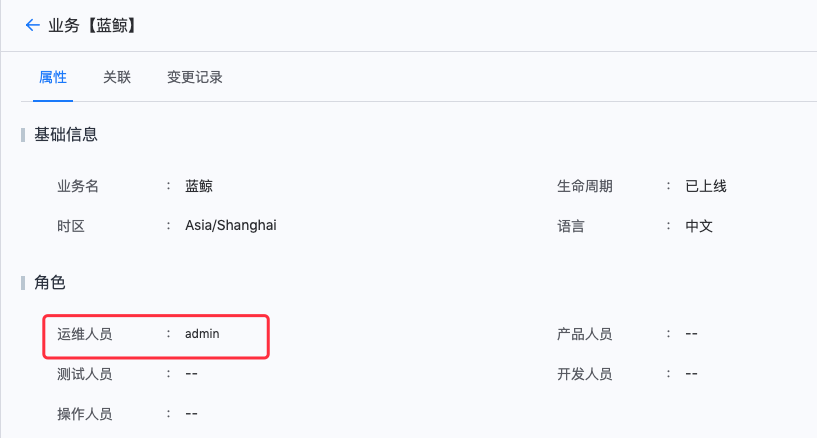

#### Q: 怎么使用Merge-Request-Accept-Hook，我的怎么没触发？我希望分支feature\_lzj\_test123123213合并到feature\_lzj\_test0117时触发流水线

.png>)

Merge Request Accept Hook会在源分支**成功merge到目标分支时触发**

比如，需要将feat\_1合并到dev分支时，分支名称写dev，监听源分支写feat\_1（也可以使用\*号的模糊匹配功能，如feat\_\*）

.png>)

**Q: gitlab触发器在哪里配置webhook地址，jenkins是需要手动配置一个url的**

不需要配置这个hook，蓝蓝盾是会自己注册webhook，选择事件类型后保存，就会自动注册webhook

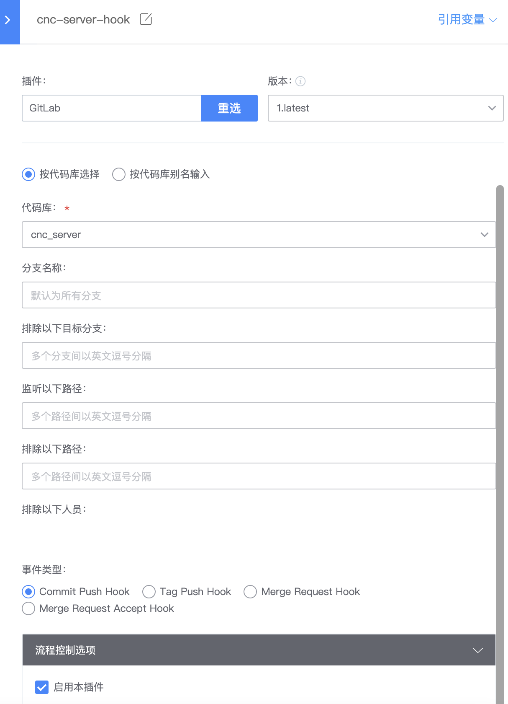

**Q: gitlab触发失败**

1. 检查分支是否匹配
2. 查看下devops\_ci\_process.T\_PIPELINE\_WEBHOOK表是否有注册这条流水线， SELECT \* FROM devops\_ci\_process.T\_PIPELINE\_WEBHOOK WHERE pipeline\_id = ${pipeline\_id}，${pipeline\_id}可以从url地址获取
3. 如果gitlab webhook页面没有注册webhook的记录，如

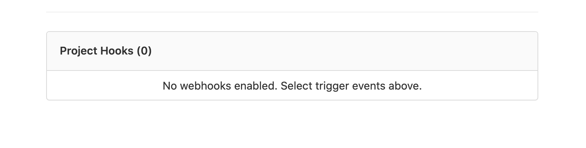

&#x20;           ① 查看repository服务到gitlab的网络是否能通，比如是否配置gitlab的域名解析

&#x20;           ② 查看gitlab仓库的权限是否是master权限，即生成accesstoken的用户需要是仓库的maintainer角色

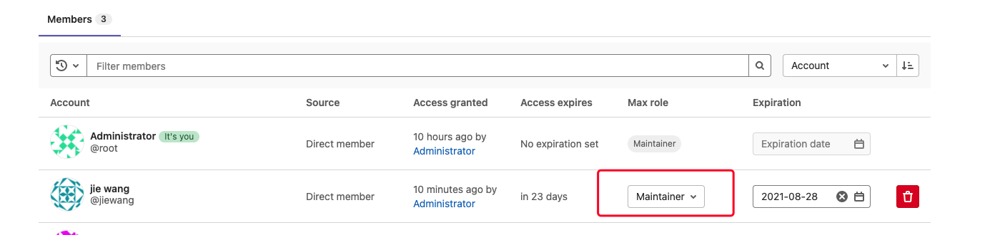

&#x20;           ③ 在repository服务部署的机器上，执行`grep "Start to add the web hook of " $BK_HOME/logs/ci/repository/repository-devops.log`查找注册失败原因，$BK\_HOME默认是/data/bkce

4\. 如果gitlab上有webhook注册记录，如


如果还是没有触发：

&#x20;           ① 点击对应webhook的Edit，查看webhook的发送详情，查看View detail


&#x20;           ② 查看发送的错误详情，检查gitlab到蓝盾机器的网络是否可达，如gitlab服务器是否能解析蓝盾域名


4\. 如果上面都没问题，在process服务部署的机器上，执行grep "Trigger gitlab build" $BK\_HOME/logs/ci/process/process-devops.log 搜索日志，查找触发的入口日志。查看gitlab push过来的请求体，对比请求体中的`http_url`字段和代码库里代码仓库的地址是否**完全**匹配，如果一个是域名形式的url，另一个是ip形式的url，则不匹配


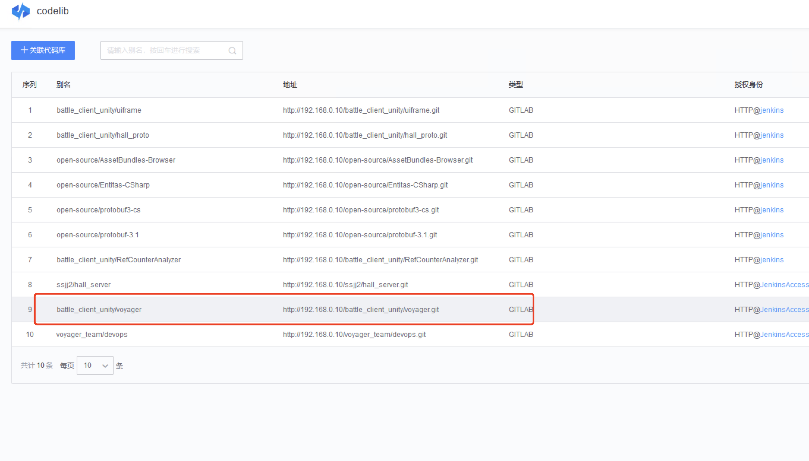

**Q: batchscript插件无法执行bat文件，bat文件里有从系统中读取的变量，是当前用户设置的**


将对应的agent服务的启动用户改为当前用户，执行命令`services.msc`打开windows服务管理界面，找到服务`devops_agent_${agent_id}`(注意：每个agent\_id是不同的，agent\_id的值可以在配置文件.agent.properties中找到)

右键->属性，在登录页签下选择此账户

如果是如入域构建机，账户名填写`域名\用户名`，例如`tencent\zhangsan`;如果没有入域的构建机，账户名填入`.\用户名`,例如`.\admin、.\administrator、.\bkdevops`，输入密码后，点击确认按钮

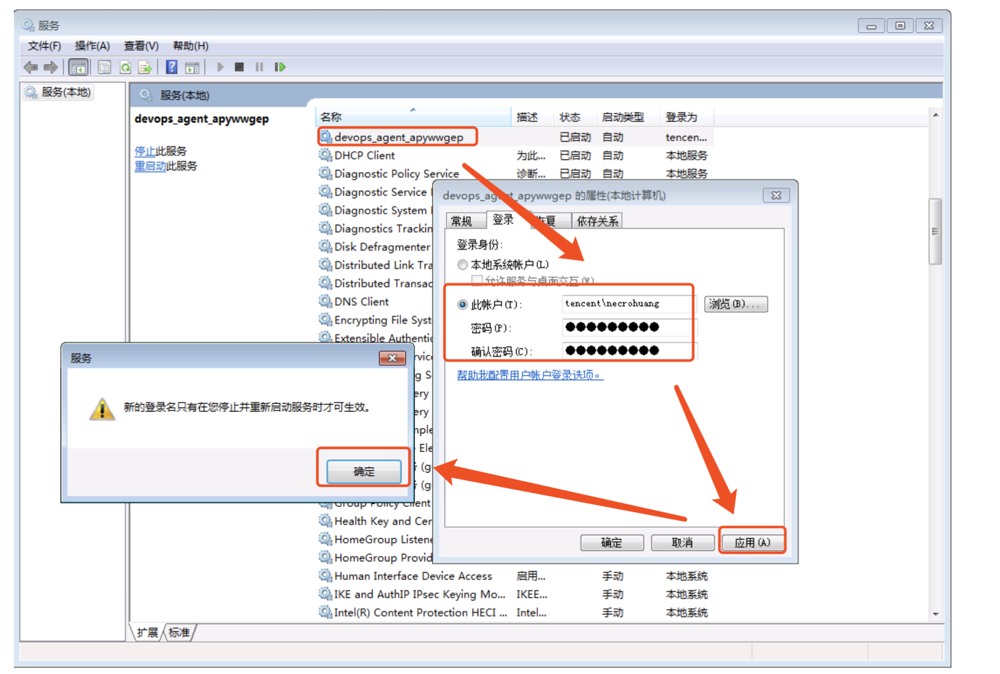

右键 -> 重新启动，重启服务

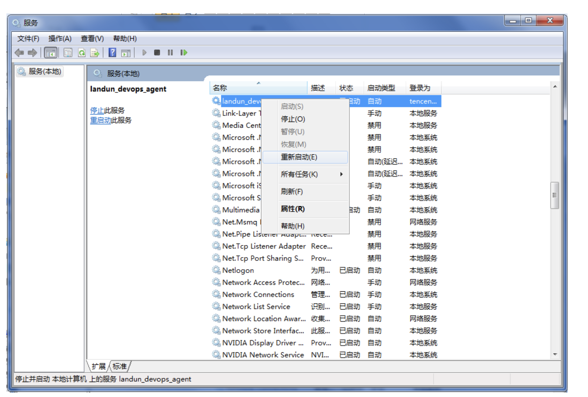

打开任务管理器，查看进程devopsDaemon.exe和的vopsAgent.exe是否存在，查看两个进程的启动的用户名是否为当前登录用户

**Q: batchscript中的命令路径有空格，执行失败**


可以将有空格的命令用引号""括起来

**Q: 怎么通过接口获取项目**

curl -X GET [https://devops.bktencent.com/prod/v3/apigw-app/projects/](https://devops.bktencent.com/prod/v3/apigw-app/projects/) -H "Content-Type: application/json" -H "X-DEVOPS-UID: admin"

**Q: 这个「只有在前面插件运行失败才执行」条件，感觉没有用，成功了也执行了**\


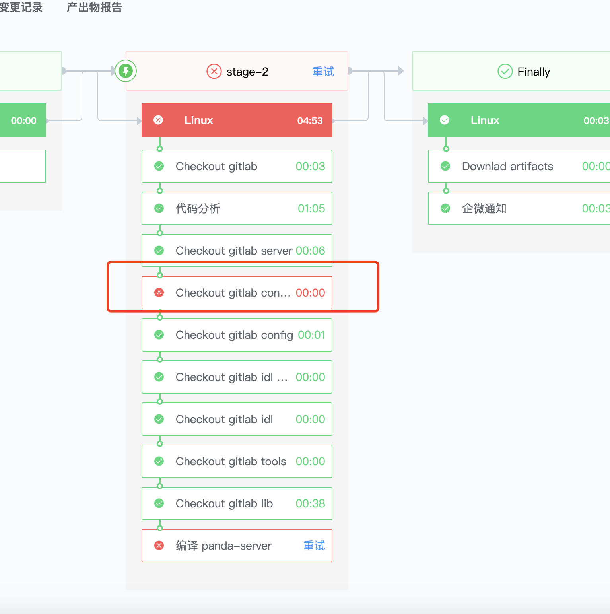

这个条件的实际意思是：在这个插件前面的任何一个插件运行失败，就符合触发条件，而不是指『上一个』插件失败时运行

**Q:项目的英文名称可以修改吗**

暂不支持修改

**Q: 怎么获取项目名称，我想要在企业微信通知消息里带上**

使用全局变量`${BK_CI_PROJECT_NAME}`

**Q: 在浏览器里完成了蓝盾登录，在同一浏览器不同tab访问蓝盾，还需要再次登录**

这种情况是登录cookie过期了，现在默认应该是两小时，过期时间可调

**Q: 有条流水线是通过gitlab触发的，但查看代码变更记录为空，说明此次触发的构建，并没有新代码变更，那为啥为触发**

可能的原因是，触发器监听了整个代码库的commit事件，但代码拉取插件只拉取了某一个特定分支的代码，而此分支并没有代码变更，比如，插件监听了整个代码库commit事件，但代码拉取插件只拉取了master分支的代码，而提交commit的是dev分支，代码变更记录显示的是所拉取的分支相交上一次体检的变更，master分支没有变更，所以没有变更记录。

**Q: 流水线跟流水线可以设置互斥吗? 或者流水线A 启动, 流水线B启动的时候, 流水线B等待流水线A结束**

现在只能对流水线中的JOB进行互斥组配置，如果这两个流水线只有一个JOB，那就这个JOB配置一个相同的互斥组就可以了。如果流水线有多个JOB，需要给两个流水线上再套一个流水线，然后在两条主流水线上配置互斥组，通过这个主流水线拉起任务。

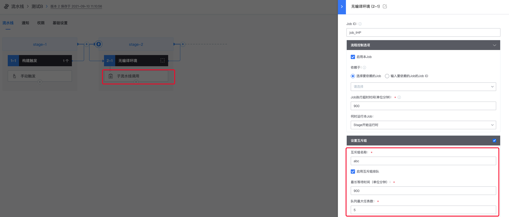

**Q: 蓝盾脚本里会起一个gradle daemon进程。最近发现，构建完就关闭。怀疑是不是devops agent处理的？**

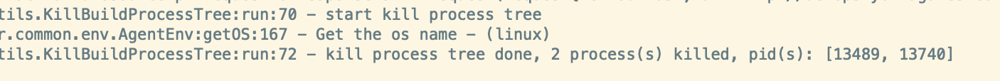

蓝盾agent执行完构建任务后，会自动停止所有由agent启动的子进程，如果不需要结束子进程，可以在启动进程前设置环境变量：set DEVOPS\_DONT\_KILL\_PROCESS\_TREE=true，在bash脚本里设置`setEnv "DEVOPS_DONT_KILL_PROCESS_TREE" "true"`

**Q: 可以设置 一个变量值, 根据这个变量, 判断是否运行某个 插件 吗**

在插件下方选择「自定义变量全部满足时才运行」，自定义变量写需要依赖的变量名称和值

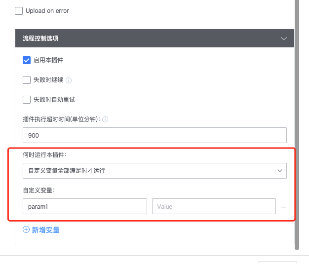

**Q: 插件变量的值怎么获取、怎么写才对，比如我想获取插件里flushDB的值，然后在脚本里进行判断，我发现这么写是错误的？**


右上角点击引用变量，然后点右边复制变量，然后粘贴到你需要的地方就可以

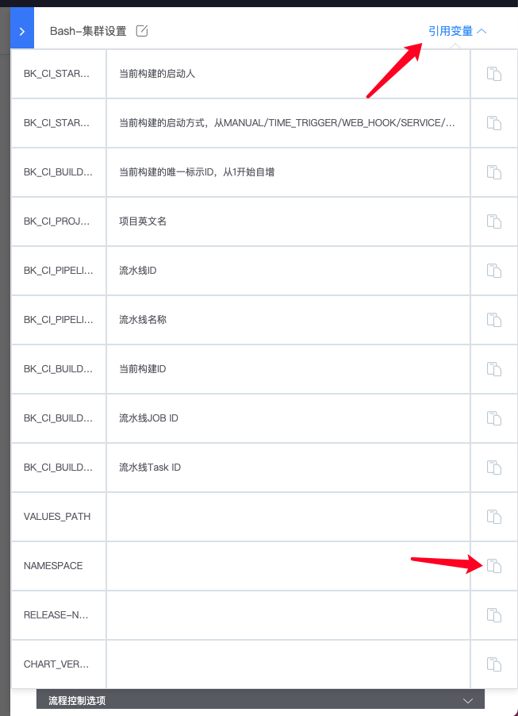

**Q: 如何在日志每一行前面加上时间戳**

占位，待解决

**Q:运行锁定, 有没有同一个时间最多运行一个构建任务, 后执行的强制取消先执行的任务**

目前还没有这样的功能

**Q: 我们有用一个 cat 去显示Log, 这个方式能用, 但有个问题, 每次打开速度都很慢, 差不多要3秒以上才显示Log 数据, 有没什么其他的比较好的方式显示log**

关于3秒以上的问题，主要因为这个task对应的日志数据较大，日志内容在3MB，所以时间花在download上

**Q: 流水线在执行中，unity的构建日志不会实时显示**

其原因是「脚本中先执行unity编译构建操作，同时将日志写入文件，但在该操作结束前，不会执行后续的cat命令，导致日志无法实时在web页面上显示」。 针对此场景，可尝试以下解决方式：

```
 nohup $UNITY_PATH -quit -batchmode -projectPath $UNITY_PROJECT_PATH -logFile $UNITY_LOG_PATH -executeMethod CNC.Editor.PackageBuilderMenu.BuildPC "${isMono} ${isDevelop} $UNITY_OUT_PATH" & echo $! > /tmp/unity_${BK_CI_BUILD_ID}.pid unity_main_pid=$(cat /tmp/unity_${BK_CI_BUILD_ID}.pid) tail -f --pid ${unity_main_pid} $UNITY_LOG_PATH
```

**Q:怎么有条件的执行CallPipeline插件**

插件下面有一个流程控制，在流程控制中根据需要添加运行条件可以满足需求

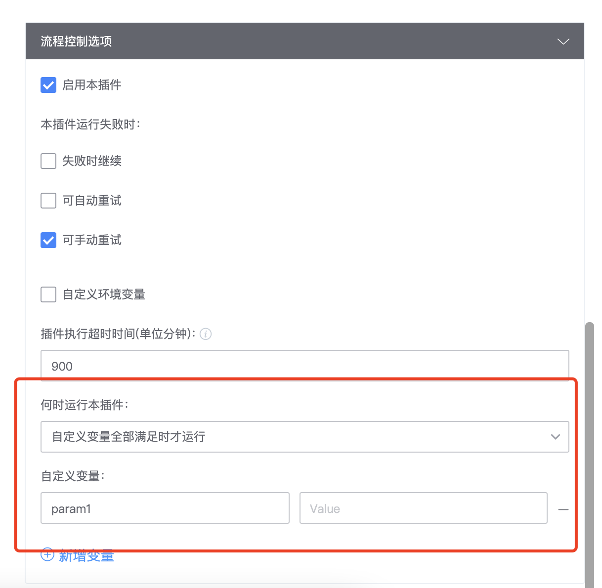

**Q: CallPipeline 这样传递参数好像不行？**

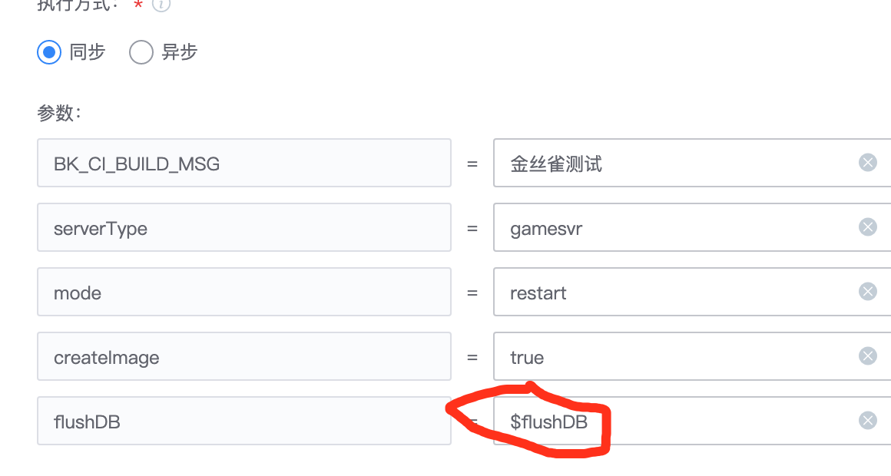

需要这样引用变量`${flushDB}`

**Q: 怎么引用全局变量，我这么引用$BK\_CI\_BUILD\_FAIL\_TASKS好像不行**

变量引用需要加花括号`${BK_CI_BUILD_FAIL_TASKS}`
