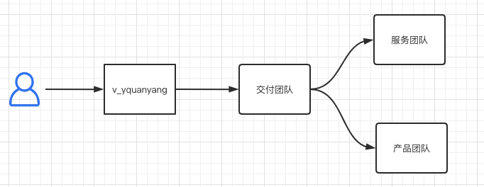

# 客户基本情况

### 二方用户情况

| 二方企业 | 蓝鲸版本  | 蓝盾版本   |
| ---- | ----- | ------ |
| 宝可拉  | 6.0.3 | 1.5.22 |
| 呦尔哈  | 6.0.3 | 1.5.30 |
| 睿逻   | 6.0.3 | 1.5.22 |

| abc         | efg   | ijk   |
| ----------- | ----- | ----- |
| fdasf       | fasdf | gsfdg |
| asgxzcgdfsd | safs  |       |
|             |       | hgsh  |


**Good to know:** your product docs aren't just a reference of all your features! use them to encourage folks to perform certain actions and discover the value in your product.

