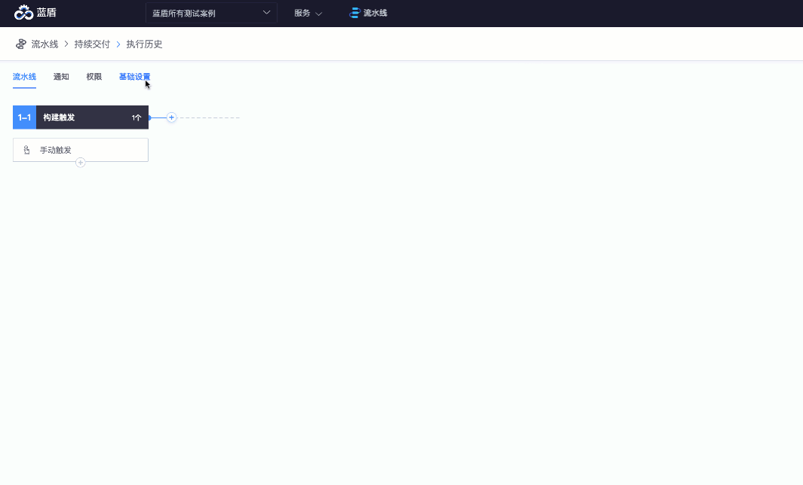

# 从空白流水线开始

本篇将介绍流水线编辑页面的各种操作。

* 添加一个Linux [Job](https://iwiki.woa.com/display/DevOps/Job)

* 指定构建镜像（点此了解[怎么制作自己的CI镜像](https://iwiki.woa.com/pages/viewpage.action?pageId=15109166)）

.png>)

* 添加插件
