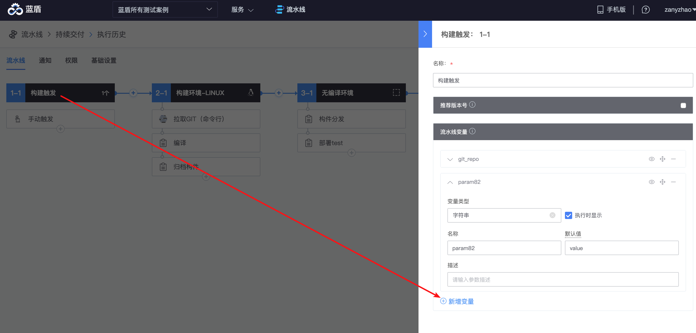

# 在流水线里使用变量

就像Jenkins的参数化构建一样，流水线也允许在启动或运行期间动态设置一些环境变量。

### 设置流水线变量 <a href="#id-zai-liu-shui-xian-li-shi-yong-bian-liang-she-zhi-liu-shui-xian-bian-liang" id="id-zai-liu-shui-xian-li-shi-yong-bian-liang-she-zhi-liu-shui-xian-bian-liang"></a>

进入流水线编辑页，点击Job1-1



默认勾选“执行时可见”，会在运行流水线的时候再次填写value，不勾选将直接使用默认值

### 执行流水线 <a href="#id-zai-liu-shui-xian-li-shi-yong-bian-liang-zhi-hang-liu-shui-xian" id="id-zai-liu-shui-xian-li-shi-yong-bian-liang-zhi-hang-liu-shui-xian"></a>

.png>)

注意： \
1.蓝盾流水线变量值可存储最长4000字节内容，超出后该变量将被丢弃，但不影响插件执行成功的状态；\
2.在【Bash】插件与【作业平台-脚本执行】插件的脚本中使用流水线变量时，**请勿使用${变量名}，而应当使用$变量名， ${变量名}会在Bash脚本下发执行之前就预先被替换成实际值。 可导致该Bash插件对该变量的任何操作都无法被后续正确读到。**

### 不要在Bash插件中使用${变量名}

在【Bash】插件与【作业平台-脚本执行】插件中的脚本内容使用流水线变量时，请勿使用${变量名}，而应当使用$变量名， ${变量名}会在Bash脚本下发执行之前就预先被替换成实际值。 会导致该Bash插件对该变量的任何操作都无法被后续正确读到。

这个算是历史遗留问题，早期蓝盾未规范变量与上下文对象使用，都是使用${XXX}进行解析，平台需要在执行插件之前就做前置的替换。 导致 ${XXX} 提前会被替换成真正的变量值。 所以在Bash脚本插件的修改都不能立即反映同一个脚本里后续的使用上。

比如 在启动流水线时 流水线变量 a=1

在2-1 Bash 插件内容为

```
setEnv "a" "2"
setEnv "b" "${a}"
```

正常来讲以上脚本预期b=2

实际： 在脚本下发到构建机上运行前，会先被平台替换为

```
setEnv "a" "2"
setEnv "b" "1" 
```

实际b=1

这是因为 set "b" "${a}" 命中了平台的上下文解析${xxx}， 优先把${a} 替换成 1了。

\
setEnv 实现\


$\{{UUID\}} 是系统生成的UUID，不可猜，也没有能直接读取的变量。

```shell
setEnv(){
        local key=$1
        local val=$2

        if [[ -z "$@" ]]; then
            return 0
        fi
        if ! echo "$key" | grep -qE "^[a-zA-Z_][a-zA-Z0-9_]*$"; then
            echo "[$key] is invalid" >&2
            return 1
        fi
	    echo $key=$val  >> ${workspace}/${BK_CI_BUILD_ID}-${{UUID}}-result.log
        export $key="$val"
    }
```

### 关于变量命名要求：

* 变量名必须符合程序变量命名规范，\[a-zA-Z\_]\[a-zA-Z0-9\_]\*

### 关于变量值的要求：

* 变量值没有限制， 但以下情况例外：
  * 如果变量值需要传递给下一个Bash插件使用时，变量需要export到bash环境变量中，需要遵守以下约定：
    * ~~8月份版本会做移除 详见 https://github.com/Tencent/bk-ci/issues/4821，以下单引号保护已经可以解决这个问题， 当前变量值如果存在 "|", "&", "(", ")" 这4种符号，如果出现了，则该变量不会被export。~~
    * 变量值如果存在 单引号 和 换行符，该变量被export 前 会被trim 掉， 以单引号保护起来，比如 export xx='yy'。避免出现换行注入脚本攻击, 使所有变量值全部变成字面字符，不再具有可解析执行性。

### windows下的环境变量要求：

* 变量值没有限制， 但以下情况例外：
  * 如果变量值需要传递给下一个Batch Script插件使用时，变量需要set到环境变量中，需要遵守以下约定：
    * 变量值存在回车符或换行符，则不会被set。
    *   变量值如果存在以下特殊字符，则会做^转义，以保证能被正常set

        ```
        	"&" to "^&",
          "<" to "^<",
          ">" to "^>",
          "|" to "^|",
          "\"" to "\\\""
        ```
